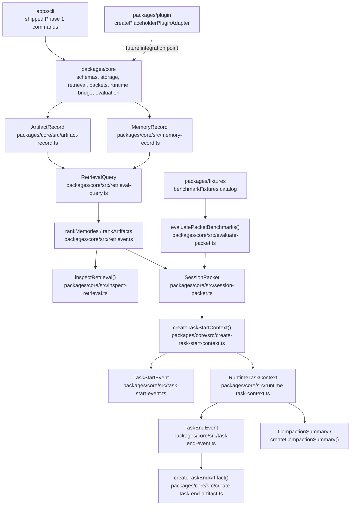

# Current architecture

This page describes the current architecture that exists in the local repo today. It is based on the code in `apps/cli`, `packages/core`, `packages/fixtures`, and `packages/plugin`, not on planned behavior.

## Package boundaries

- `apps/cli` is the Phase 1 command surface. It exposes the currently shipped commands for logging artifacts, promoting memory, querying history, preparing session packets, evaluating packet benchmarks, and generating fixture artifacts.
- `packages/core` is the architectural center. It owns the record schemas, storage helpers, retrieval and ranking logic, session packet preparation, runtime bridge types and helpers, compaction helpers, and packet evaluation logic.
- `packages/fixtures` contains benchmark fixture definitions that feed packet evaluation.
- `packages/plugin` is a placeholder adapter package. It advertises placeholder metadata only and does not own the runtime bridge.



## Persistent records and storage

### `ArtifactRecord`

`ArtifactRecord` is defined in `packages/core/src/artifact-record.ts`. It is the durable record for completed work and includes:

- task classification fields such as `taskType`, `repoId`, and optional `taskId`
- execution summary fields such as `promptSummary`, `filesInspected`, `filesChanged`, `commands`, `diagnostics`, and `verification`
- outcome fields such as `outcome`, optional `failureReason`, optional `cost`, optional `latencyMs`, and `tags`
- `createdAt` as the persisted timestamp

`packages/core/src/artifact-store.ts` persists this record under the artifact store path. In the current architecture, the CLI writes and reads this durable shape directly, and the runtime bridge reuses the same shape through `createTaskEndArtifact()`.

### `MemoryRecord`

`MemoryRecord` is defined in `packages/core/src/memory-record.ts`. It is the durable promoted-memory unit and includes:

- identity and scope fields: `id`, `scope`, optional `repoId`, optional `taskId`
- memory content fields: `kind`, `value`, `source`, `sourceArtifactIds`, and `confidence`
- lifecycle fields: `createdAt`, `updatedAt`, and optional `expiresAt`

The schema enforces the current scope rules:

- `task-local` memory requires `taskId`
- `repo-local` memory requires `repoId`
- `user-global` memory must not include `repoId` or `taskId`

`packages/core/src/memory-store.ts` persists these records into the scope-specific memory paths. Promotion is still explicit in the current CLI, which means memory creation is not yet automated by the runtime bridge.

## Retrieval query, ranking, and inspection

### `RetrievalQuery`

`RetrievalQuery` is defined in `packages/core/src/retrieval-query.ts`. It is the normalized retrieval request used by the ranking layer. The current fields are:

- `repoId`
- `taskType`
- `tags`, defaulting to an empty array
- optional `preferredOutcome`
- optional `referenceTime`

This query shape is shared by both the shipped history query flow and the packet preparation helpers in `packages/core`.

### Ranking in `rankMemories()` and `rankArtifacts()`

`rankMemories()` and `rankArtifacts()` live in `packages/core/src/retriever.ts`. Both functions normalize the incoming query, score candidate records, attach reason labels, and sort descending by score.

Shared scoring behavior:

- repo match adds a strong `repo-match` signal
- overlapping normalized tags add `tag-overlap`
- a valid `referenceTime` can add a `recent` bonus based on age

Artifact-specific scoring:

- matching `taskType` adds `task-type-match`
- matching `preferredOutcome`, either by `outcome` or by normalized tags, adds `outcome-match`

Memory-specific scoring:

- memory ranking derives tags from `kind`, `scope`, `sourceArtifactIds`, and tokenized `value`
- `task-local` memory gets a small `scope-bonus`
- recency uses `updatedAt`, not `createdAt`

The result type is `ScoredRetrieval<T>`, which carries the original record, a numeric score, and the list of retrieval reasons.

### `inspectRetrieval()`

`inspectRetrieval()` is defined in `packages/core/src/inspect-retrieval.ts`. It takes already ranked memories and artifacts, applies `maxMemories` and `maxArtifacts` limits, and returns the selected slices as `selectedMemories` and `selectedArtifacts`.

The important architectural role is separation of concerns:

- storage helpers persist records
- ranking functions score candidates
- `inspectRetrieval()` produces the explicit inspection view with copied scores and reason lists

That keeps retrieval inspection separate from storage and separate from automatic promotion behavior, which does not exist yet.

## Session packet preparation and runtime entry

### `SessionPacket`

`SessionPacket` is defined in `packages/core/src/session-packet.ts`. It is the compact prepared packet produced before runtime execution. The current fields are:

- `id`, `repoId`, `taskType`, optional `taskId`
- `selectedMemoryIds` and `selectedArtifactIds`
- `suggestedRoute`
- `verificationChecklist`
- `rationale`
- `createdAt`

Architecturally, this is the boundary object between retrieval and runtime execution. It carries selected evidence IDs and route guidance without embedding full record payloads.

### How `prepareSessionPacket()` fits in

`prepareSessionPacket()` in `packages/core/src/prepare-session-packet.ts` is the current packet builder used by the Phase 1 CLI and reused by the runtime bridge helpers. It:

- classifies the prompt into a `taskType`
- recommends a route from explicit hints or simple prompt heuristics
- derives retrieval tags from the prompt plus route hints
- builds the `RetrievalQuery`
- ranks memories and artifacts, slices them to the configured limits, and emits the packet
- generates the current rationale string and verification checklist

That is why `SessionPacket` sits in the middle of both the shipped CLI flow and the newer Phase 2 bridge types.

### `createTaskStartContext()`

`createTaskStartContext()` is defined in `packages/core/src/create-task-start-context.ts`. It is the bridge from packet preparation into an active runtime context. The helper:

- calls `prepareSessionPacket()`
- resolves full `MemoryRecord` and `ArtifactRecord` objects from the selected IDs
- builds the initial verification state from the packet checklist plus optional overrides
- emits a typed `TaskStartEvent`
- assembles and validates the full `RuntimeTaskContext`

It returns both the event and the in-memory context as `{ taskStart, context }`.

### `TaskStartEvent`

`TaskStartEvent` is defined in `packages/core/src/task-start-event.ts`. It is the typed runtime entry record. The current schema captures:

- task identity: `id`, `repoId`, optional `taskId`, and `taskType`
- task text: `taskText`
- selected evidence IDs: `selectedMemoryIds` and `selectedArtifactIds`
- route and verification state: `suggestedRoute` and `verificationState`
- open questions: `unresolvedQuestions`
- timing: `createdAt` and `startedAt`

The schema also enforces that completed verification steps must already exist in the checklist, and that `startedAt` cannot be earlier than `createdAt`.

Concrete example:

```json
{
  "id": "packet-release-build-001-start",
  "repoId": "repo-alpha",
  "taskId": "task-release-build-002",
  "taskType": "verification",
  "taskText": "Verify the release build and report whether it passes with evidence.",
  "selectedMemoryIds": ["memory-release-build-001"],
  "selectedArtifactIds": ["artifact-release-build-001"],
  "suggestedRoute": "verify",
  "verificationState": {
    "status": "pending",
    "checklist": [
      "Capture the exact verification command results and status.",
      "Run pnpm build.",
      "Run pnpm test.",
      "For repo-alpha release checks, run pnpm build and pnpm test before reporting success."
    ],
    "completedSteps": []
  },
  "unresolvedQuestions": [],
  "createdAt": "2026-04-21T12:10:00.000Z",
  "startedAt": "2026-04-21T12:10:00.000Z"
}
```

This matches the current helper flow in `createTaskStartContext()`, where `createdAt` and `startedAt` both come from the input `referenceTime` and the checklist comes from `prepareSessionPacket()` plus any optional verification-state overrides.

### `RuntimeTaskContext`

`RuntimeTaskContext` is defined in `packages/core/src/runtime-task-context.ts`. It is the validated in-memory working context for an active task. It contains:

- top-level task identity and prompt
- the `SessionPacket`
- the selected `MemoryRecord[]` and `ArtifactRecord[]`
- the `TaskStartEvent`
- the current `verificationState`
- `unresolvedQuestions`
- `createdAt`

Its schema is intentionally strict. It checks that `repoId`, `taskId`, selected evidence IDs, unresolved questions, and verification state stay aligned across the top-level context, the packet, and the start event. In other words, it is the consistency boundary for runtime state.

Concrete example:

```json
{
  "repoId": "repo-alpha",
  "taskId": "task-release-build-002",
  "prompt": "Verify the release build and report whether it passes with evidence.",
  "packet": {
    "id": "packet-release-build-001",
    "repoId": "repo-alpha",
    "taskType": "verification",
    "taskId": "task-release-build-002",
    "selectedMemoryIds": ["memory-release-build-001"],
    "selectedArtifactIds": ["artifact-release-build-001"],
    "suggestedRoute": "verify",
    "verificationChecklist": [
      "Capture the exact verification command results and status.",
      "Run pnpm build.",
      "Run pnpm test.",
      "For repo-alpha release checks, run pnpm build and pnpm test before reporting success."
    ],
    "rationale": "Selected 1 memories and 1 artifacts for repo repo-alpha based on task type verification, structured tag overlap, and recency.",
    "createdAt": "2026-04-21T12:10:00.000Z"
  },
  "selectedMemories": [
    {
      "id": "memory-release-build-001",
      "scope": "repo-local",
      "repoId": "repo-alpha",
      "kind": "summary",
      "value": "For repo-alpha release checks, run pnpm build and pnpm test before reporting success.",
      "source": "artifact-analysis",
      "sourceArtifactIds": ["artifact-release-build-001"],
      "confidence": "high",
      "createdAt": "2026-04-21T12:05:00.000Z",
      "updatedAt": "2026-04-21T12:05:00.000Z"
    }
  ],
  "selectedArtifacts": [
    {
      "id": "artifact-release-build-001",
      "taskType": "verification",
      "repoId": "repo-alpha",
      "taskId": "task-release-build-001",
      "promptSummary": "Verify the release build and capture the result.",
      "filesInspected": ["package.json", "pnpm-workspace.yaml"],
      "filesChanged": [],
      "commands": ["pnpm build"],
      "diagnostics": ["Build completed without TypeScript errors."],
      "verification": ["pnpm build", "pnpm test"],
      "outcome": "success",
      "tags": ["verify", "build", "release"],
      "createdAt": "2026-04-21T12:00:00.000Z"
    }
  ],
  "taskStart": {
    "id": "packet-release-build-001-start",
    "repoId": "repo-alpha",
    "taskId": "task-release-build-002",
    "taskType": "verification",
    "taskText": "Verify the release build and report whether it passes with evidence.",
    "selectedMemoryIds": ["memory-release-build-001"],
    "selectedArtifactIds": ["artifact-release-build-001"],
    "suggestedRoute": "verify",
    "verificationState": {
      "status": "pending",
      "checklist": [
        "Capture the exact verification command results and status.",
        "Run pnpm build.",
        "Run pnpm test.",
        "For repo-alpha release checks, run pnpm build and pnpm test before reporting success."
      ],
      "completedSteps": []
    },
    "unresolvedQuestions": [],
    "createdAt": "2026-04-21T12:10:00.000Z",
    "startedAt": "2026-04-21T12:10:00.000Z"
  },
  "verificationState": {
    "status": "pending",
    "checklist": [
      "Capture the exact verification command results and status.",
      "Run pnpm build.",
      "Run pnpm test.",
      "For repo-alpha release checks, run pnpm build and pnpm test before reporting success."
    ],
    "completedSteps": []
  },
  "unresolvedQuestions": [],
  "createdAt": "2026-04-21T12:10:00.000Z"
}
```

This is the current consistency boundary in action. The selected record IDs, packet fields, top-level `verificationState`, and `taskStart` payload all have to stay aligned for the schema to accept the context.

## Runtime completion and bounded compaction

### `TaskEndEvent`

`TaskEndEvent` is defined in `packages/core/src/task-end-event.ts`. It is the typed runtime exit record. The current schema includes:

- the task identity and text fields
- `promptSummary`
- selected memory and artifact IDs
- `suggestedRoute`
- `verificationState`
- `unresolvedQuestions`
- `filesInspected`, `filesChanged`, `commands`, and `diagnostics`
- `outcome`, optional `failureReason`, optional `cost`, optional `latencyMs`, and `tags`
- `startedAt` and `endedAt`

Like `ArtifactRecord`, it requires `failureReason` when `outcome` is `failure`. It also enforces `endedAt >= startedAt`.

Concrete example:

```json
{
  "id": "packet-release-build-001-start",
  "repoId": "repo-alpha",
  "taskId": "task-release-build-002",
  "taskType": "verification",
  "taskText": "Verify the release build and report whether it passes with evidence.",
  "promptSummary": "Verified the release build and captured the result with supporting evidence.",
  "selectedMemoryIds": ["memory-release-build-001"],
  "selectedArtifactIds": ["artifact-release-build-001"],
  "suggestedRoute": "verify",
  "verificationState": {
    "status": "passed",
    "checklist": [
      "Capture the exact verification command results and status.",
      "Run pnpm build.",
      "Run pnpm test.",
      "For repo-alpha release checks, run pnpm build and pnpm test before reporting success."
    ],
    "completedSteps": [
      "Capture the exact verification command results and status.",
      "Run pnpm build.",
      "Run pnpm test."
    ]
  },
  "unresolvedQuestions": [],
  "filesInspected": ["package.json", "pnpm-workspace.yaml"],
  "filesChanged": [],
  "commands": ["pnpm build", "pnpm test"],
  "diagnostics": [
    "Build completed without TypeScript errors.",
    "Tests passed in the release workspace."
  ],
  "outcome": "success",
  "cost": 0.18,
  "latencyMs": 4200,
  "tags": ["verify", "build", "release"],
  "startedAt": "2026-04-21T12:10:00.000Z",
  "endedAt": "2026-04-21T12:14:12.000Z"
}
```

`createTaskEndArtifact()` turns this richer runtime event back into the durable `ArtifactRecord` shape, adds a `Verification status: passed` diagnostic line, and extends the artifact tags with the route and verification status.

### `createTaskEndArtifact()`

`createTaskEndArtifact()` is defined in `packages/core/src/create-task-end-artifact.ts`. It converts the richer runtime exit event back into the durable `ArtifactRecord` shape used by the existing artifact store.

The helper currently does three important pieces of shaping:

- copies the durable artifact fields from the task-end event
- appends unresolved questions and verification status into `diagnostics`
- extends artifact `tags` with the suggested route and verification status, then de-duplicates them

This is the main reuse point between the runtime bridge and the already shipped persistence model.

### `CompactionSummary`

`CompactionSummary` is defined in `packages/core/src/compaction-summary.ts`. It is the typed, bounded summary shape for active task state. The schema carries:

- `repoId`, optional `taskId`, and `taskText`
- selected memory and artifact IDs
- `suggestedRoute`
- `verificationState`
- `unresolvedQuestions`
- `compactedAt`, `startedAt`, and `endedAt`

The schema enforces time ordering for `startedAt`, `endedAt`, and `compactedAt`.

Concrete example:

```json
{
  "repoId": "repo-alpha",
  "taskId": "task-release-build-002",
  "taskText": "Verify the release build and report whether it passes with evidence.",
  "selectedMemoryIds": [
    "memory-release-build-001",
    "memory-release-build-002",
    "memory-release-build-003"
  ],
  "selectedArtifactIds": [
    "artifact-release-build-001",
    "artifact-release-build-002"
  ],
  "suggestedRoute": "verify",
  "verificationState": {
    "status": "passed",
    "checklist": [
      "Capture the exact verification command results and status.",
      "Run pnpm build.",
      "Run pnpm test.",
      "Confirm the release artifact matches the expected version.",
      "Record the final pass or fail decision."
    ],
    "completedSteps": [
      "Capture the exact verification command results and status.",
      "Run pnpm build.",
      "Run pnpm test.",
      "Record the final pass or fail decision."
    ]
  },
  "unresolvedQuestions": [
    "Were the release notes generated from the same commit?",
    "Should the smoke test run against staging or production?"
  ],
  "compactedAt": "2026-04-21T12:15:00.000Z",
  "startedAt": "2026-04-21T12:10:00.000Z",
  "endedAt": "2026-04-21T12:14:12.000Z"
}
```

This example fits the current helper output contract in `createCompactionSummary()`: task text stays bounded, selected memory IDs are capped at three, selected artifact IDs are capped at two, checklist and completed steps are capped at five, and completed steps are filtered so they still exist in the retained checklist.

### `createCompactionSummary()`

`createCompactionSummary()` is defined in `packages/core/src/create-compaction-summary.ts`. It creates a bounded summary by trimming the input to explicit limits:

- task text is capped at 280 characters
- selected memories are capped at 3 IDs
- selected artifacts are capped at 2 IDs
- verification checklist and completed steps are each capped at 5 items
- unresolved questions are capped at 3 items

It also filters completed verification steps so only steps still present in the retained checklist survive. That makes compaction structured and deterministic instead of becoming an unbounded free-form note.

## Fixtures and evaluation

### Fixtures

`packages/fixtures/src/benchmark-fixtures.ts` exports the frozen `benchmarkFixtures` catalog. Each fixture captures a prompt, expected route, repo metadata, route hints, checklist hints, tags, and whether the item belongs to the train or held-out split.

These fixtures are the current evaluation input for packet quality. They are not plugin callbacks or runtime sessions. They are benchmark definitions.

### `evaluatePacketBenchmarks()`

`evaluatePacketBenchmarks()` is defined in `packages/core/src/evaluate-packet.ts`. It runs each fixture twice:

- once with retrieval enabled, using the supplied memory and artifact records
- once with retrieval disabled, by passing empty record sets

It then compares the two packet outputs using the current metrics:

- `packetCompleteness`
- `routeHitRate`
- `expectedTagHitRate`
- `verificationChecklistCoverage`
- `selectedRecordCount`
- `selectedCommandCount`

The result includes per-benchmark outputs plus an aggregate summary. In the current architecture, this is the concrete path for checking whether retrieval improves packet quality.

## Plugin placeholder

`packages/plugin/src/index.ts` exports `createPlaceholderPluginAdapter()`. Today it returns placeholder metadata only:

- `kind: 'plugin-adapter'`
- `packageName: '@meta-harness/plugin'`
- `status: 'placeholder'`

That means the plugin package marks an integration seam, but it does not yet own routing, retrieval, runtime state, or packet generation. Those behaviors still live in `packages/core`.

## How this relates to the docs set

- Use [../usage/mvp-usage.md](../usage/mvp-usage.md) for the current end-to-end CLI walkthrough.
- Use this page when you need the detailed explanation of how the shipped records, retrieval pipeline, runtime bridge helpers, fixtures, and placeholder plugin fit together.
